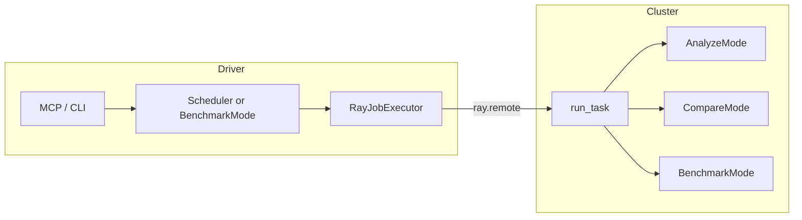

---
myst:
    html_meta:
        "description": "Understand Magpie's Ray integration driver-worker model, executor selection, and end-to-end task flow for running GPU workloads on remote Ray clusters."
        "keywords": "Magpie, Ray architecture, RayJobExecutor, driver worker, remote GPU, distributed benchmark, ROCm, CUDA"
---

# Magpie on Ray architecture

Magpie's Ray integration offloads analyze, compare, and benchmark workloads from the machine running the CLI or MCP server onto GPU-capable worker nodes in a Ray cluster, without changing the evaluation logic itself. The integration is built around a driver-worker split: the driver process submits a remote function through `RayJobExecutor`, and the worker node executes the same `AnalyzeMode`, `CompareMode`, or `BenchmarkMode` code it would run locally. This page describes how executor selection works, how the task flows end-to-end, and where to find the relevant source files.

Magpie's Ray integration follows a driver-worker model where the driver submits tasks and workers execute them on GPU-capable nodes.

## Driver vs worker

Magpie's Ray integration uses two roles: the driver process that submits work, and the worker nodes that execute it.

- **Driver**: process running `python -m Magpie …`, MCP, or your script. It calls `Scheduler` or `BenchmarkMode`, connects with `ray.init(address=…)`, and submits a remote function.
- **Worker**: Ray executes `Magpie.remote.tasks.run_task` on a GPU-capable node. That function dispatches to `_run_analyze`, `_run_compare`, or `_run_benchmark`.

## Executor selection

The executor is chosen based on `SchedulerConfig.environment_type`.

| `SchedulerConfig.environment_type` | Executor | Execution |
|-----------------------------------|----------|-----------|
| `local` | `LocalExecutor` | Subprocesses on the driver machine (`Magpie/core/executor.py`). |
| `container` | Container executor | Isolated environment on the driver (kernel flows). |
| `ray` | `RayJobExecutor` | `ray.remote(run_task)` on a cluster node (`Magpie/core/ray_executor.py`). |

Benchmark mode additionally uses `BenchmarkConfig.run_mode`: `docker`, `local`, or `ray`. When `run_mode` is `ray`, `BenchmarkMode` builds a `Task` and uses `RayJobExecutor` internally (`Magpie/modes/benchmark/benchmarker.py`).

## End-to-end flow

## Related topics

- [Magpie on Ray](../how-to/ray.md) — how-to guide covering cluster setup, configuration, shared storage, and troubleshooting
- [Benchmark frameworks with Magpie](../how-to/benchmarking/benchmark.md) — benchmark run modes including `run_mode: ray`
- [Magpie benchmarking mode architecture](benchmarking-architecture.md) — how the benchmark pipeline is designed and how components interact
- [Ray documentation](https://docs.ray.io/) — cluster setup, job submission, and runtime environments