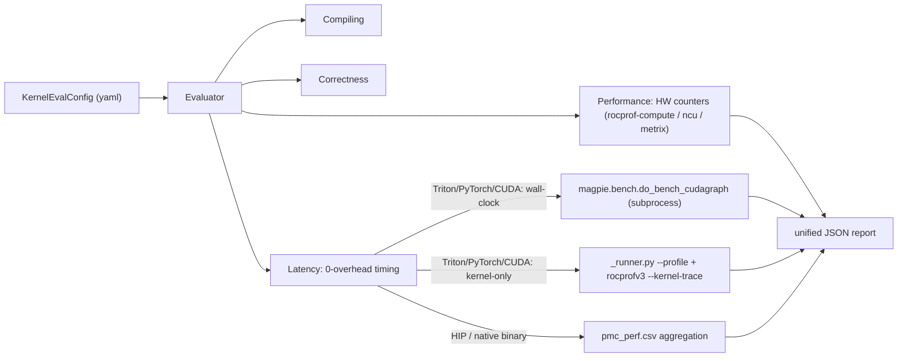

# 0-Overhead Kernel Latency

The **Latency** stage runs alongside Magpie's `Performance` stage and produces a 0-overhead measurement of how long the kernel actually takes to run, free of Python, JIT, and dispatch noise.

It complements (rather than replaces) the HW-counter metrics from `rocprof-compute` / `ncu` / `metrix`, which are already 0-overhead but measure *throughput*-style quantities (FLOPs, bandwidth, occupancy). Latency answers the orthogonal question: *how many milliseconds does each kernel call take?*

## Two timing semantics — and when to use each

There are two fundamentally different ways to ask "how long does this kernel take?" Magpie supports both and emits them side-by-side in the report.

| Method | What it measures | Use when |
| --- | --- | --- |
| **`cuda_graph`** (wall-clock) | End-to-end per-call latency including one CUDA-graph launch's worth of host overhead. Implemented via `do_bench_cudagraph`: warmup → estimate graph → unrolled replay → median across `n_retries`. Dispatch is amortized across `n_repeat` calls inside a single graph capture. | Comparing two *different* kernel implementations end-to-end (e.g. PyTorch vs Triton vs HIP), reporting numbers that match what production sees. |
| **`kernel_trace`** (kernel-only) | Pure HW per-dispatch duration extracted from `rocprofv3 --kernel-trace`. The runner runs in `--profile` mode (tight `for _ in range(N): fn()` loop, no graph capture, no event recording) so the outer profiler captures clean kernel start/end timestamps. | **Kernel-config autotuning** (BLOCK_M, num_warps, num_stages, etc.). Dispatch overhead is roughly constant across configs; for small kernels (single-digit microseconds) it dominates wall-clock noise and obscures the actual config-to-config kernel improvement. |

The default `method: auto` resolves to:

- `both` for `triton` / `pytorch` / `cuda` kernels — runs *both* methods and reports `dispatch_overhead_us = wall_median - kernel_median`.
- `rocprof_timestamps` for `hip` kernels — reuses the `pmc_perf.csv` already produced by the `Performance` stage (no extra subprocess), since a HIP testcase is a native binary that doesn't import torch.

You can pin the method via `latency.method` in YAML or `--latency-method` on the CLI.

## Architecture



## Wiring up a Triton kernel

There are two ways to feed your Triton kernel into the Latency harness.

### A. Import-based (recommended)

Add a `bench_target` block to your kernel config. Magpie spawns a tiny subprocess that imports `module.callable`, materializes inputs from `module.get_inputs`, and runs `do_bench_cudagraph`. No additional Python harness required.

```yaml
kernel:
  id: triton_scaled_mm
  type: triton
  source_files: [./my_kernels/scaled_mm.py]
  testcase_command: "python -m my_kernels.scaled_mm --check"
  bench_target:
    module: my_kernels.scaled_mm
    callable: triton_scaled_mm
    get_inputs: get_inputs

latency:
  enabled: true
  method: auto
  primary_metric: kernel_median_ms   # rank by kernel-only latency for autotuning
  rep_ms: 20
  n_retries: 5
  estimate_reps: 5
  warmup_iters: 5
  seed: 42
  pythonpath:
    - /abs/path/to/my_kernels_repo   # so non-installed packages import cleanly
```

`get_inputs` must return either:

- a 2-tuple `(args, kwargs)` where `args` is a tuple/list and `kwargs` is a dict, or
- a positional tuple/list (treated as `args`), or
- a dict (treated as `kwargs`).

Whatever shape it returns, the runner calls your kernel as `callable(*args, **kwargs)`.

### B. User harness (escape hatch)

If your kernel has multi-step / multi-stream behavior that doesn't fit the import-based mold, write your own harness that uses `magpie.bench` and prints the canonical marker line. Magpie will pick it up from your `testcase_command` stdout.

```python
# my_kernels/bench_harness.py
import json
from Magpie.bench import do_bench_cudagraph, MAGPIE_LATENCY_JSON_MARKER

def fn():
    # ...issue your workload onto the current CUDA stream...
    pass

stats = do_bench_cudagraph(fn, rep=20, n_retries=5, estimate_reps=5)
print(f"{MAGPIE_LATENCY_JSON_MARKER} {json.dumps({'stats': stats.to_dict()})}")
```

Then point `kernel.testcase_command` at it; do not set `bench_target`.

## Reproducibility

The runner sets `torch.manual_seed(seed)` and `torch.cuda.manual_seed_all(seed)` **before** materializing inputs. Combined with a deterministic `get_inputs` (use `torch.randn` with the seeded RNG), this yields stable tensor shapes and contents across runs — a prerequisite for trustworthy autotuning comparisons.

If your benchmarked function depends on global state (`torch.set_default_dtype`, environment variables, etc.), set those inside `get_inputs` or in a module-level initializer that runs at import time.

## What the report contains

`<workspace>/analyze_report.json`:

```json
{
  "summary": [
    {
      "kernel_id": "triton_scaled_mm",
      "latency_state": "SUCCESS",
      "latency": {
        "method": "both",
        "primary_metric": "kernel_median_ms",
        "primary_value_ms": 0.118,
        "wall_median_ms": 0.142,
        "kernel_median_ms": 0.118,
        "dispatch_overhead_us": 24.0,
        "crosscheck_vs_rocprof_ratio": 1.20
      }
    }
  ],
  "results": [
    {
      "latency_result": {
        "method": "both",
        "wall_stats":   { "median_ms": 0.142, "p99_ms": 0.151, "samples_ms": [...] },
        "kernel_stats": { "median_ms": 0.118, "p99_ms": 0.124, "samples_ms": [...] },
        "per_kernel": { "triton_scaled_mm_kernel": { "median_ms": 0.117, ... } },
        "dispatch_overhead_us": 24.0,
        "config": { "rep_ms": 20, "n_retries": 5, "warmup_iters": 5, "seed": 42 }
      }
    }
  ]
}
```

`dispatch_overhead_us = wall_median_ms*1000 - kernel_median_ms*1000`. For typical small Triton kernels this lands in the single-digit-to-low-double-digit microsecond range.

`crosscheck_vs_rocprof_ratio = wall / kernel`. Magpie warns when it's outside `[0.5, 2.0]` — that usually indicates warmup pollution, kernel_filter swallowing the wrong dispatches, or another kernel being captured inadvertently.

## CLI overrides

```bash
python -m Magpie analyze -k triton_scaled_mm.yaml \
    --latency-method kernel_trace \
    --latency-rep-ms 50

# Disable the latency stage entirely
python -m Magpie analyze -k triton_scaled_mm.yaml --no-latency
```

## Anti-pattern (do *not* do this in your testcase)

```python
for j in range(n_iter):
    start_events[j].record()
    mod.triton_scaled_mm(...)        # includes Python + JIT + dispatch
    end_events[j].record()
    torch.cuda.synchronize()
```

This times the host-driven launch path (Python dispatcher, JIT specialization, autotune cache lookup, runtime overhead) along with the kernel itself. Magpie scans your testcase scripts for this pattern and emits a warning pointing here.

The `Performance` stage's rocprof-based numbers remain accurate even if your testcase contains this anti-pattern (they come from HW timestamps, not your timing loop) — but any latency the *script itself* prints will be inflated.

## See also

- [`Magpie/bench/__init__.py`](../Magpie/bench/__init__.py) — `do_bench_cudagraph` and `LatencyStats`.
- [`Magpie/bench/_runner.py`](../Magpie/bench/_runner.py) — subprocess harness contract (env vars, `--profile` flag, marker line).
- [`Magpie/eval/latency.py`](../Magpie/eval/latency.py) — orchestration, rocprofv3/pmc_perf parsers.
- [`Magpie/config/latency.py`](../Magpie/config/latency.py) — `LatencyConfig`, `BenchTarget`, `auto`-method selection table.
- [Performance + Compare](analysis_compare.md) — how the latency block plugs into ranking.
- [Benchmark Mode](benchmark.md) — framework-level vLLM / SGLang benchmarks (separate use case).
